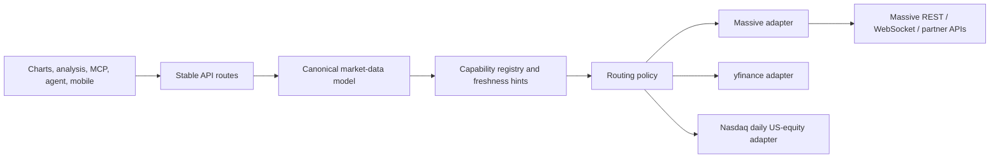

# System Design: Massive-First Market Data

Status: implemented baseline with documented gaps. The Massive REST adapter is present in
`app/massive.py` and routed through `MarketDataClient`; WebSockets, flat files, and partner
datasets remain future capability work.

## Goal

Put a keyed, entitlement-aware Massive adapter in front of the existing market-data providers
without changing the public chart, analysis, MCP, agent, or native-app contracts. Massive’s raw
REST/WebSocket/partner schemas stay behind one server-side boundary.

## Shape of the system



The route layer asks for a capability, not for a provider. The routing policy chooses the first
eligible adapter, and the normalizer converts its result into the existing chart-data shapes.
Indicator math and rendering remain downstream of that normalization boundary.

## Adapter boundary

The provider interface is capability-oriented:

```text
get_daily_bars(ticker, start, end, adjusted)
get_intraday_bars(ticker, interval, start, end, adjusted)
get_snapshot(ticker)
get_stock_reference(ticker)
get_options_contracts(underlying, filters)
get_options_chain(underlying)
get_ticker_events(identifier, types)
```

Adapters return a canonical result or a typed provider error. They do not return Flask responses,
PNG payloads, indicator objects, or provider-specific field names. The first Massive implementation
should use REST for on-demand bars, snapshots, reference data, and options; WebSocket and flat-file
work can be added later without changing this interface. Massive documents REST for on-demand
queries, WebSockets for live streams, and Flat Files for bulk historical data in the [REST
quickstart](https://massive.com/docs/rest/quickstart).

## Canonical result contract

Existing public response keys remain stable. `provider` and `provider_note` are additive market
data metadata, and existing clients can continue to read `datasets`,
`series`, `levels`, `rows`, and `meta`.

```json
{
  "ticker": "AAPL",
  "asset_class": "stocks",
  "bars": [
    {"date": "2026-08-18", "open": 1, "high": 1, "low": 1, "close": 1, "volume": 1}
  ],
  "provider": "massive",
  "provider_note": "Massive market data; freshness depends on the configured Stocks and Options plans",
  "data": {"results": []}
}
```

The universal `data_meta` shape remains a future additive extension. The current implementation
uses `/api/providers`, `/api/capabilities`, `provider`, and `provider_note` for sanitized routing
and freshness information; it does not invent source timestamps that the upstream response did
not provide.

Required semantics:

- `provider` is `massive`, `yfinance`, `nasdaq`, or `mixed` at the envelope level.
- `freshness` is `end_of_day`, `delayed_15m`, `realtime`, or `updated_daily`.
- `as_of` is the newest source observation when the provider supplies one; `retrieved_at` is
  server receipt time. They are not interchangeable.
- `fallback_used` is true whenever the preferred route was bypassed or failed.
- `fallback_reason` is sanitized and machine-readable; it never includes an API key, URL query
  string, or raw provider response.
- Per-ticker metadata wins over a batch-level summary. A mixed batch must not be labeled as
  real-time merely because one result is real-time.

## Routing and failure policy

```text
if MASSIVE_API_KEY is configured and capability is entitled:
    try Massive with bounded retries for transient failures
    if valid result: normalize and return
if MARKET_DATA_FALLBACK_ENABLED:
    try yfinance
    if daily US-equity and yfinance fails: try Nasdaq
return normalized error
```

The policy classifies failures as follows:

| Failure | Retry | Fallback |
| --- | --- | --- |
| Timeout, connection failure, 429, 5xx | Bounded | Yes when enabled |
| 401/403 or plan entitlement miss | No | Yes when enabled; mark `not_entitled` |
| Empty provider result or unsupported coverage | No | Yes when the next adapter can answer |
| Invalid request parameters | No | No automatic retry; return a client error |
| Malformed upstream JSON | Bounded once if transient, then | Yes when enabled; record `invalid_upstream_response` |

This preserves the existing `yfinance → Nasdaq` resilience while making a staging flag capable
of exposing entitlement gaps. The router must not fall back from a partner corporate-event
dataset to price bars and call the result equivalent.

## Entitlements and freshness

Massive’s plans are not a single global permission bit. The [stock custom-bars table](https://massive.com/docs/rest/stocks/aggregates/custom-bars)
documents Basic as end-of-day/two years, Starter as 15-minute delayed/five years, Developer as
15-minute delayed/ten years, and Advanced as real-time/all history. The [stock trades table](https://massive.com/docs/rest/stocks/trades-quotes/trades)
documents trades as unavailable on Basic and Starter, 15-minute delayed/ten years on Developer,
and real-time/all history on Advanced. The [single-ticker snapshot](https://massive.com/docs/rest/stocks/snapshots/single-ticker-snapshot)
documents Basic as unavailable, Starter and Developer as 15-minute delayed, and Advanced as
real-time.

Options use a separate Basic/Starter/Developer/Advanced family. [Options reference contracts](https://massive.com/docs/rest/options/overview)
are available on all Options plans, while bars, snapshots, trades, and quotes are marked as
select-plan capabilities. The capability registry must keep `stocks.*` and `options.*` separate.

Native [ticker events](https://massive.com/docs/rest/stocks/corporate-actions/ticker-events) are
experimental, updated daily, and currently support only `ticker_change`. [Partner datasets](https://massive.com/docs/rest/partners/overview)
such as TMX corporate events and Benzinga have dedicated subscriptions and licensing terms.
They are opt-in capability families, not automatic extensions of a core Stocks or Options plan.

## Additive capability endpoints

The endpoints are:

- `GET /api/providers`: existing provider status, extended additively with sanitized routing
  state and fallback order.
- `GET /api/capabilities`: declared Massive capability IDs with `available`, `freshness`,
  `history`, and a sanitized `reason` when unverified or unavailable. It is not a live
  authorization check; request-time 401/403 responses remain authoritative.
- `GET /api/capabilities/<capability>`: one capability object for preflight UI gating.

Capability IDs should be stable and namespaced, for example `stocks.daily_bars`,
`stocks.intraday_bars`, `stocks.snapshot`, `stocks.ticker_events`, `stocks.dividends`,
`stocks.splits`, `stocks.financials`, `options.contracts`, `options.chain`, and
`partners.tmx_corporate_events`. Clients ignore unknown future IDs. A
capability response never contains `MASSIVE_API_KEY` or raw upstream payloads.

The existing `/api/charts/<chart_type>`, `/api/data/charts/<chart_type>`,
`/api/data/tools/*`, analysis, agent, and MCP endpoints remain compatible. Optional new
capabilities are additive; they do not change the meaning of existing `ticker`, `tickers`,
`period`, `start_date`, `end_date`, or watchlist fields.

## Doppler configuration

The names below are the server configuration contract. Doppler stores the values; this
document intentionally shows no secret values.

| Variable | Role |
| --- | --- |
| `MASSIVE_API_KEY` | Server-only authentication secret |
| `MASSIVE_REST_BASE_URL` | REST base URL, default `https://api.massive.com` |
| `MASSIVE_TIMEOUT_SECONDS` | Per-call timeout |
| `MASSIVE_MAX_RETRIES` | Maximum transient retry count |
| `MASSIVE_MAX_PAGES` | Maximum pagination pages to collect per request |
| `MARKET_DATA_FALLBACK_ENABLED` | Permit yfinance/Nasdaq routing after Massive failure |
| `MASSIVE_STOCKS_PLAN` | Sanitized declared Stocks tier for capability hints |
| `MASSIVE_OPTIONS_PLAN` | Sanitized declared Options tier for capability hints |
| `MASSIVE_FINANCIALS_PLAN` | Sanitized financials/ratios entitlement declaration |

Plan variables are hints, not authorization. The adapter updates capability state from observed
upstream responses and treats a 401/403 as unavailable until configuration is corrected. Secret
values must stay out of `/api/config`, logs, provider notes, error messages, client bundles, and
committed documentation.

The baseline audit found no ThetaData imports, dependencies, endpoints, or consumers. The
remaining yfinance usage in `app/sec.py` is a separate Yahoo-hosted SEC filings mirror fallback,
not a market-data path.

## Observability and rollout

The first rollout should be dark or explicitly flagged: expose provider and capability status,
run Massive against a small set of daily-bar reads, compare normalized values to the existing
provider, then enable fallback-protected traffic. Record only provider name, capability ID,
latency, status class, freshness, fallback reason, and Massive `request_id` when supplied. Never
record the API key or full authenticated URL.

Before enabling intraday, options, event, or partner controls, verify the exact subscription for
the endpoint and surface the result through `/api/capabilities`. A successful daily-bar smoke
test is not evidence that trades, snapshots, options, or partner events are entitled.
