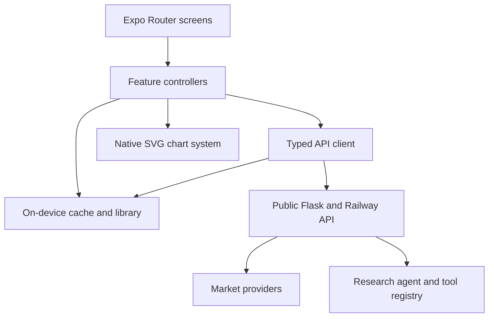
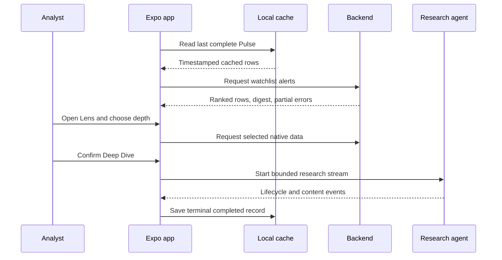
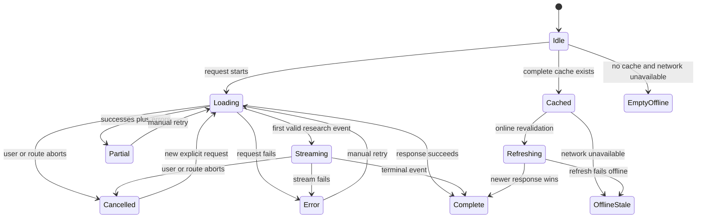

# Undercurrent Expo Go iOS App - Plan

## Goal Capsule

| Field | Contract |
| --- | --- |
| Objective | Ship a tested, native-feeling iPhone research tool that turns the existing Underlying Analyzer APIs into a fast path from market pulse to explainable research. |
| Means | Add a self-contained Expo SDK 54 application named Undercurrent with native SVG charts, a Research Depth Dial, resilient public API access, and an on-device library (KTD1-KTD10). |
| Authority | User requirements outrank this plan; live repository contracts outrank generated API descriptions; official Expo SDK 54 documentation governs Expo Go compatibility. |
| Execution profile | Complete the plan before implementation, use parallel agents only for independent research or isolated work, and keep shared-worktree writes dependency ordered. |
| Stop conditions | Stop if physical-iPhone Expo Go compatibility requires a different SDK, the public API contract is invalidated, or the required Git worktree and branch cannot be preserved. |
| Tail ownership | The autonomous shipping workflow owns simplification, code review, fixes, commits, push, PR creation, browser/native smoke evidence, and CI follow-through. |

---

## Product Contract

### Summary

Undercurrent is a pocket research instrument with three top-level destinations: Pulse, Lists, and Library.
Users open a ticker Lens, choose Glance, Diagnose, or Deep Dive, and receive native chart intelligence or an explicit research run without inheriting the existing terminal website's layout.

### Problem Frame

The backend exposes 39 public endpoints, 21 agent tools, and chart-ready datasets, but the current product is a desktop-first web terminal.
Copying that interface onto a phone would preserve its density, image-heavy output, and desktop navigation instead of using the backend as a native product platform.
The mobile client must also survive provider fallbacks, partial batch results, slow research streams, stale data, and Expo Go's fixed native runtime.
The commissioning user explicitly rejected a mobile-web adaptation and asked for a novel native research app, making fast pulse-to-research use on an iPhone the release-one demand signal.

### Key Decisions

- **Native product, not a web adaptation.** The app gets a new information architecture, visual language, and signature research interaction. Governs R2, R4, R5. (session-settled: user-directed; rejected alternative: adapting the mobile web terminal)
- **Expo Go on ordinary physical iPhones.** The app targets the App Store Expo Go compatibility line rather than requiring a development build, TestFlight, or paid Apple account. Governs R1. (session-settled: user-directed; rejected alternative: requiring a custom development build)
- **Research, not trade execution.** The app explains signals and sources but never implies brokerage connectivity or places orders. Governs R9.
- **Guest-first persistence.** The first release saves bounded research and watchlists on-device; cross-device Supabase auth waits for an Expo redirect contract. Governs R6, R7, R10.

### Actors

- A1. The analyst scans a market pulse, opens a ticker, adjusts research depth, and saves useful results.
- A2. The public Flask/Railway service supplies capability, market, chart, watchlist, and research data.
- A3. The research agent runs only after an explicit request and reports its tool lifecycle to A1.

### Requirements

**Runtime and product identity**

- R1. The project opens in the ordinary physical-iPhone Expo Go client by targeting Expo SDK 54 and its compatible native dependency versions.
- R2. The UI uses a novel native composition, system-aware typography, safe areas, haptics, sheets, and touch interactions instead of copying the mobile web terminal.
- R3. The app lives in a self-contained `mobile/` package and does not require a new repository-wide JavaScript workspace.

**Market discovery and chart intelligence**

- R4. Pulse loads ranked rows and the alert digest from one `/api/watchlists/alerts` request, preserves partial successes, and discloses provider and freshness metadata.
- R5. A ticker Lens draws responsive charts from `/api/data/...` JSON, uses category-indexed trading sessions, and offers an accessible data-list alternative.
- R6. Lists accepts up to 10 validated manual symbols or a public TradingView watchlist URL resolved by the backend, previews imports before saving them as a new list, and opens the same Lens experience without duplicating domain logic.

**Research lifecycle and persistence**

- R7. The Research Depth Dial exposes Glance, Diagnose, and Deep Dive with a button-equivalent control and a preview of the work each level starts.
- R8. Deep Dive streams agent events when supported, can cancel safely, ignores stale request generations, and uses the non-streaming endpoint only when preflight proves the streaming route unavailable before dispatch; after dispatch or any received byte, failure requires a new explicit Retry.
- R9. Expensive scans, agent calls, image tools, scheduler actions, and externally visible side effects never run automatically or auto-retry after partial work.
- R10. The on-device Library stores at most 24 schema-versioned completed records, capped at 128 KiB each and 3 MiB total, with generated and cached timestamps; it supports per-record Delete and confirmed Clear All and never stores secrets, base64 chart artifacts, or incomplete streams.

**Resilience, accessibility, and proof**

- R11. Every network surface represents fresh, stale-refreshing, offline-stale, empty-offline, partial, error, streaming, cancelled, and completed states when applicable.
- R12. Controls meet 44-point targets, meaning is not color-only, Dynamic Type can reflow layouts, Reduce Motion removes nonessential animation, and charts expose screen-reader summaries and adjustable actions.
- R13. The repository includes deterministic contract, parser, cache, geometry, component, and browser-flow tests plus live public API smoke coverage.
- R14. Completion evidence distinguishes static exports, browser rendering, iOS simulator behavior, Expo Go host behavior, and physical-device-only checks.

### Key Flows

- F1. Pulse to Lens
  - **Trigger:** A1 opens the app or refreshes Pulse.
  - **Actors:** A1, A2
  - **Steps:** Show cached rows if present; request the alert digest; preserve successful rows and partial errors; open a selected ticker Lens; load only the selected chart surface.
  - **Outcome:** A1 reaches an explainable ticker view without waiting for heavy research or duplicate cockpit work.
  - **Covered by:** R4, R5, R11
- F2. Research depth to saved result
  - **Trigger:** A1 changes depth and confirms a Research Run.
  - **Actors:** A1, A2, A3
  - **Steps:** Preview tools and cost; start the bounded request; stream lifecycle events; allow cancellation; save only a terminal completed result.
  - **Outcome:** A1 understands what ran and can revisit the result on-device.
  - **Covered by:** R7-R10
- F3. Offline recovery
  - **Trigger:** A1 opens or refreshes while the API is unreachable.
  - **Actors:** A1, A2
  - **Steps:** Retain timestamped cached content; label it stale; disable new research; expose retry; replace content only after a newer request wins.
  - **Outcome:** The app remains honest and useful without presenting stale values as live.
  - **Covered by:** R10, R11

### Acceptance Examples

- AE1. Covers F1 / R4. Given two valid tickers and one invalid ticker, when Pulse returns successful rows plus `meta.errors`, then the valid rows remain visible and the invalid symbol appears as a nonblocking partial-error notice.
- AE2. Covers R5 / R12. Given a 5-day auction series on a 320-point-wide device with large text, when A1 opens Lens, then the plot has no weekend gaps, labels do not clip, and a screen reader can traverse the same values through an alternate data view.
- AE3. Covers F2 / R8. Given an NDJSON record split across UTF-8 chunks after leading blank padding, when Deep Dive runs, then the parser emits each complete event once, cancellation aborts the request, and late events do not update the screen.
- AE4. Covers F3 / R11. Given cached Pulse data and no network, when A1 launches the app, then the cached rows render with an `as of` timestamp, refresh is unavailable, and Retry remains visible.
- AE5. Covers R1 / R14. Given a clean install of the pinned dependencies, when validation runs, then Expo dependency checks, iOS and web exports, rendered browser flows, and available simulator checks each report separate pass or limitation evidence.

### Success Criteria

- The first app frame and navigation render without waiting for a market request.
- Pulse uses one bootstrap request and keeps Ridge, portfolio, scans, and agent research off initial load.
- The primary flow fits 320-, 375-, and 430-point widths and remains usable at accessibility font sizes.
- From a warm cache, an analyst reaches a provider- and freshness-labeled ticker Lens in two taps and under one second of client-side work; live-provider latency is reported separately.
- No client bundle, fixture, log, screenshot, or saved record contains server credentials.
- The PR includes screenshots from a cloud-runnable rendered flow and records whether an iOS simulator and a physical Expo Go scan were available.

### Scope Boundaries

**In scope**

- A complete guest-first Expo Go application with Pulse, Lists, ticker Lens, Research Run, and on-device Library.
- Native chart primitives for the datasets required by the primary flow.
- Public API capability checks, handwritten contracts, runtime guards, caching, cancellation, and partial-error behavior.

#### Deferred to Follow-Up Work

- Supabase magic-link auth, cross-device saved research, authenticated watchlists, and alert-rule administration after Expo redirect URLs are configured.
- Remote notifications, universal links, widgets, App Store packaging, custom native splash behavior, and production development builds.
- The 1.43 MB Ridge pack, portfolio benchmarking, PDF/share pipelines, background resumable scans, and the remaining chart catalog.
- A backend fix for the `benchmark` versus `benchmark_ticker` contract drift and HTTP server URL reported by OpenAPI.

**Outside this product's identity**

- Brokerage accounts, order entry, trade execution, unattended financial decisions, or wording that presents research as financial advice.

### Dependencies

- The public HTTPS service at `https://underlying-terminal-production.up.railway.app` remains reachable and CORS-enabled.
- Public TradingView watchlists are resolved only through `POST /api/watchlists/resolve`, whose backend validator owns scheme, host, path, and private-list rejection.
- The App Store Expo Go client remains compatible with SDK 54 for ordinary physical iPhones.
- Release-one delivery is developer-run Metro plus an Expo Go QR code on a reachable network; if the App Store client stops accepting SDK 54, KTD1 is reopened and an EAS development build becomes the fallback.
- Live provider and agent availability can degrade independently; deterministic fixtures remain the CI authority.

---

## Planning Contract

### Key Technical Decisions

- KTD1. **Pin Expo SDK 54.** Use the SDK 54 template and Expo-installed compatible native versions because current App Store Expo Go does not provide the released SDK 56 client and SDK 55+ physical-device paths add provisioning requirements. Re-check the official compatibility line immediately before scaffolding and reopen this decision if it changed.
- KTD2. **Use a self-contained Router package.** Put Expo Router screens, tests, and Node tooling under `mobile/`; the Python root remains unchanged.
- KTD3. **Handwrite guarded API contracts.** Do not generate the client from OpenAPI because success schemas are generic, `tickers` is misdeclared, the portfolio parameter drifts, and the advertised server URL is HTTP.
- KTD4. **Render bounded native SVG geometry.** Use a small number of paths, pixel-aware decimation, native text labels, and an accessible data list rather than PNG-first rendering or thousands of SVG nodes.
- KTD5. **Bootstrap once and load depth lazily.** Pulse uses `/api/watchlists/alerts`; Lens surfaces load on demand; Ridge, portfolio, scans, and research require explicit actions.
- KTD6. **Model the transport as a state machine.** The typed client owns aborts, request generations, partial errors, and stale cache reads. Capability data is fresh for 15 minutes, Pulse for 60 seconds, and chart data for 5 minutes; ordinary requests time out after 30 seconds, capability checks after 10 seconds, and research uses a 45-second idle timeout rather than a total-duration timeout.
- KTD7. **Use `expo/fetch` for NDJSON.** The parser keeps a carry buffer, accepts CRLF/LF, skips blank padding, validates terminal events, batches UI updates, rejects any record or undelimited carry above 256 KiB, and never retries after a streamed request is dispatched.
- KTD8. **Persist completed local records only.** AsyncStorage receives versioned JSON with LRU pruning at 24 research records, 128 KiB per record, and 3 MiB total; credentials, base64, and partial streams remain memory-only.
- KTD9. **Make Undercurrent visually independent.** Use warm graphite surfaces, translucent mineral cards, semantic mint/coral/cyan accents, system typography, restrained motion, and a haptic Research Depth Dial with a segmented-control fallback. (session-settled: user-directed; rejected alternative: a generic mobile dashboard with segment-only depth selection)
- KTD10. **Keep proof surfaces distinct.** Browser E2E is the cloud baseline; iOS simulator, exact Expo Go host, VoiceOver, haptics, and physical-device behavior receive separate receipts or explicit limitations.

### High-Level Technical Design

**Component topology**



**Pulse-to-research sequence**



**Network and research lifecycle**



### Output Structure

```text
mobile/
  app/
    (tabs)/
    ticker/[symbol].tsx
    research.tsx
    _layout.tsx
  src/
    api/
    components/charts/
    components/ui/
    features/
    state/
    theme/
  __tests__/
  e2e/
  assets/
  app.json
  package.json
  package-lock.json
  tsconfig.json
  README.md
```

### Assumptions

- `Undercurrent` is a working product name; changing it later does not alter the information architecture.
- A local on-device Library satisfies the first release because Expo magic-link redirect configuration is not currently documented or cloud-verifiable.
- Browser E2E is always available in the cloud task; macOS iOS simulator and physical-device proof may require separate environments.
- The mobile client may use recorded production fixtures for deterministic tests while live smoke checks remain nonblocking provider-health evidence.
- The app can omit custom portfolio benchmarks until the backend contract is repaired.
- The public agent endpoint remains the server-side enforcement boundary; the client can fail closed and verify the echoed tool set but cannot grant or revoke backend privileges.

### System-Wide Impact

- The API remains source-compatible; the mobile package consumes public surfaces without changing backend behavior.
- The agent gains a new explicit client; the mobile client requests only a fixed, read-only tool subset and verifies the server's echoed start set, while backend enforcement remains outside this plan.
- Repository CI gains Node and Expo checks that should stay scoped to `mobile/` so Python contributors do not need the mobile toolchain for unrelated changes.
- Public API cost and latency increase only after explicit user actions; launch and background behavior do not trigger LLM or long-scan endpoints.

### Risks and Mitigations

| Risk | Mitigation |
| --- | --- |
| Expo Go moves off SDK 54 | Reopen KTD1 immediately; use an EAS development build if the ordinary Expo Go client can no longer load the pinned project. |
| RN 0.81 is outside current support | Limit the exception to Expo Go compatibility and avoid unsupported community-native modules. |
| OpenAPI differs from runtime | Use handwritten guards, live fixtures, and contract tests against representative routes. |
| Large duplicated datasets cause slow screens | Load lazily, normalize immediately, decimate before render, and prune persisted records. |
| Provider or agent availability changes | Show provider/readiness metadata, preserve partial success, and keep manual Retry. |
| Stream chunks race with cancellation | Use AbortController plus request generations and ignore stale events; disclose that cancellation may not stop backend work already executing. |
| Cloud proof is mistaken for physical proof | Report each validation environment separately and never claim haptics or VoiceOver from simulator evidence. |

---

## Implementation Units

### U1. Create the Expo Go application shell

- **Goal:** Establish the SDK 54 package, native navigation, Undercurrent theme, and stable test/tooling baseline.
- **Requirements:** R1-R3, R12
- **Dependencies:** None
- **Files:** `mobile/package.json`, `mobile/package-lock.json`, `mobile/app.json`, `mobile/tsconfig.json`, `mobile/eslint.config.js`, `mobile/jest.config.js`, `mobile/app/_layout.tsx`, `mobile/app/(tabs)/_layout.tsx`, `mobile/app/(tabs)/index.tsx`, `mobile/app/(tabs)/lists.tsx`, `mobile/app/(tabs)/library.tsx`, `mobile/app/ticker/[symbol].tsx`, `mobile/app/research.tsx`, `mobile/src/theme/tokens.ts`, `mobile/__tests__/app-shell.test.tsx`
- **Approach:** Re-check the current Expo Go compatibility line, scaffold from the SDK 54 Router template, install native packages with Expo's version resolver, enable strict TypeScript, and build real tab, stack, status-bar, safe-area, loading, and empty surfaces. Add accessible ticker and Research placeholder routes that U5 and U6 replace before final verification.
- **Execution note:** Start with dependency validation and a shell render test before feature code.
- **Patterns to follow:** Expo SDK 54 Router conventions and system safe-area primitives; keep all Node configuration inside `mobile/`.
- **Test scenarios:**
  - Render all three tabs without network access and verify Pulse is the initial route.
  - Open a ticker stack route and Research sheet route with accessible labels and 44-point controls.
  - Render at 320-, 375-, and 430-point widths and a large font scale without clipped navigation labels.
  - Enable reduced motion and verify the shell omits nonessential reveal animation.
- **Verification:** Expo reports only SDK-compatible packages; the shell renders on iOS and web exports without backend access.

### U2. Build the resilient typed data boundary

- **Goal:** Provide one guarded transport, cache, and NDJSON lifecycle for every feature.
- **Requirements:** R4, R8-R11, R13
- **Dependencies:** U1
- **Files:** `mobile/src/api/client.ts`, `mobile/src/api/contracts.ts`, `mobile/src/api/guards.ts`, `mobile/src/api/endpoints.ts`, `mobile/src/api/ndjson.ts`, `mobile/src/state/cache.ts`, `mobile/src/state/network.ts`, `mobile/src/test/fixtures/`, `mobile/__tests__/api/client.test.ts`, `mobile/__tests__/api/ndjson.test.ts`, `mobile/__tests__/api/cache.test.ts`
- **Approach:** Configure the HTTPS base through one public environment value; validate symbols as 1-15 uppercase letters, digits, dots, or hyphens and encode every interpolation; normalize chart and tool envelopes; convert transport failures into typed states; preserve `meta.errors`; apply KTD6 freshness and timeout values; cache only complete bounded records with schema metadata.
- **Execution note:** Prove split-line parsing, abort behavior, request-generation races, and partial results before feature integration.
- **Patterns to follow:** Backend error envelope in `docs/api.md`, dataset variants in `docs/chart-data-rendering.md`, and event protocol in `docs/agent.md`.
- **Test scenarios:**
  - Parse UTF-8 characters and JSON delimiters split across every chunk boundary, CRLF, blank padding, multiple records, final carry, malformed records, and missing terminal events.
  - Abort a request mid-record and verify no incomplete record persists or reaches subscribers.
  - Start a replacement request and verify late results from the old generation cannot overwrite the new state.
  - Return successful rows plus per-symbol errors and verify the response remains partial rather than total failure.
  - Read fresh, stale-refreshing, offline-stale, empty-offline, corrupted, and migrated cache records.
  - Reject an HTTP server URL from API discovery and retain the configured HTTPS base.
  - Reject symbols containing path/query delimiters and encode every accepted symbol before building a request.
  - Reject a stream record or undelimited carry above 256 KiB without persisting partial output.
- **Verification:** Deterministic tests prove every transport state and no persisted object contains credentials, base64 artifacts, or partial streams.

### U3. Implement accessible native chart primitives

- **Goal:** Turn backend series into responsive, performant, screen-reader-usable mobile charts.
- **Requirements:** R5, R12, R13
- **Dependencies:** U1, U2
- **Files:** `mobile/src/components/charts/geometry.ts`, `mobile/src/components/charts/decimate.ts`, `mobile/src/components/charts/LineChart.tsx`, `mobile/src/components/charts/AuctionChart.tsx`, `mobile/src/components/charts/MoneylineChart.tsx`, `mobile/src/components/charts/ChartDataTable.tsx`, `mobile/__tests__/charts/geometry.test.ts`, `mobile/__tests__/charts/charts.test.tsx`
- **Approach:** Build scale and aggregation functions as pure modules; represent trading dates by index; aggregate SVG subpaths; expose chart summaries, adjustable point traversal, and a native data list; keep color secondary to labels and line styles.
- **Execution note:** Test geometry and decimation before visual components, then inspect representative fixtures at compact widths.
- **Patterns to follow:** Dataset semantics in `docs/chart-data-rendering.md` and Apple small-screen chart accessibility guidance cited under Sources.
- **Test scenarios:**
  - Cover empty, one-point, flat, negative, null, nonfinite, and missing-overlay datasets without `NaN` or `Infinity` output.
  - Decimate a dense line while preserving first, last, minimum, and maximum values.
  - Aggregate candles without losing open, high, low, close, or volume extrema.
  - Render an all-zero moneyline ladder as unavailable positioning rather than invented walls.
  - Navigate chart points through accessibility increment/decrement actions and open the equivalent data list.
  - Render labels at large font scale without overlapping the primary plot.
- **Verification:** Charts render from recorded fixtures, preserve financial extrema, remain bounded in node count, and expose the same values without sight or gestures.

### U4. Deliver Pulse and Lists

- **Goal:** Provide fast market discovery, watchlist input, and honest degraded states.
- **Requirements:** R4, R6, R10-R12
- **Dependencies:** U2, U3
- **Files:** `mobile/src/features/pulse/PulseScreen.tsx`, `mobile/src/features/pulse/PulseCard.tsx`, `mobile/src/features/lists/ListsScreen.tsx`, `mobile/src/features/lists/watchlists.ts`, `mobile/src/components/ui/AsyncState.tsx`, `mobile/app/(tabs)/index.tsx`, `mobile/app/(tabs)/lists.tsx`, `mobile/__tests__/features/pulse.test.tsx`, `mobile/__tests__/features/lists.test.tsx`
- **Approach:** Use the newest local list or `AAPL, MSFT, NVDA` as the first-launch Pulse set; request the alert digest once; render ranked cards with lane, score, setup, provider, and freshness; save manual lists locally; send only locally validated TradingView HTTPS URLs to `POST /api/watchlists/resolve`; preview a successful import and save it as a new named list without overwriting prior lists; reuse shared ticker navigation.
- **Patterns to follow:** Watchlist precedence and partial-error behavior in `app/main.py`; do not call cockpit after alerts.
- **Test scenarios:**
  - Covers AE1. Render valid rows and a partial-error notice from one mixed response.
  - Covers AE4. Load cached Pulse immediately, then replace it only after the newest live request succeeds.
  - Show fresh, stale-refreshing, offline-stale, empty-online first run, empty-offline, total-error, and manual-retry variants.
  - Normalize duplicate/lowercase symbols while preserving a stable user-visible list order.
  - Resolve a public TradingView URL through the backend, preview and save it as a new list, and handle invalid/private URLs without losing prior lists.
  - Tap a Pulse or Lists row and open the same ticker Lens route.
- **Verification:** The home path makes one bootstrap request, heavy endpoints remain idle, and every failure state stays actionable.

### U5. Build the ticker Lens and Research Depth Dial

- **Goal:** Create the app's signature native analysis surface and progressively disclose heavier work.
- **Requirements:** R2, R5, R7, R9, R12
- **Dependencies:** U3, U4
- **Files:** `mobile/app/ticker/[symbol].tsx`, `mobile/src/features/lens/LensScreen.tsx`, `mobile/src/features/lens/ResearchDepthDial.tsx`, `mobile/src/features/lens/lens-model.ts`, `mobile/src/components/ui/MetricCard.tsx`, `mobile/__tests__/features/lens.test.tsx`, `mobile/__tests__/features/depth-dial.test.tsx`
- **Approach:** Glance loads fast torque and auction context; changing the Dial only updates its preview and haptic detent; an explicit `Open Glance`, `Open Diagnose`, or `Start Deep Dive` button activates the selected level. Diagnose reveals selected chart and list intelligence; Deep Dive previews the agent tools before opening Research Run; haptic detents fire only on real selection changes and always have visible text feedback.
- **Patterns to follow:** Use `/api/data/...` rather than rendered images, omit custom portfolio benchmarks, and treat missing fundamentals or options data as explicit unavailable panels.
- **Test scenarios:**
  - Covers AE2. Render auction data at compact widths and large font scale with accessible equivalent values.
  - Change depth by drag and by segmented controls and verify both produce the same selected state.
  - Hold at each detent and verify only the associated lazy requests are eligible to start.
  - Disable haptics or enable reduced motion and preserve all visible interaction feedback.
  - Render missing revenue, missing overlays, and all-zero options data without empty chart chrome.
  - Keep each torque, auction, and Diagnose panel independent: loading, fresh, stale-refreshing, unavailable, error-with-Retry, and partial states retain successful sibling panels.
  - Leave Lens during a request and verify cancellation prevents a late update.
- **Verification:** The Lens feels complete at Glance, heavier data is user-triggered, and the signature control works without gesture, animation, color, or haptics.

### U6. Add Research Run and the on-device Library

- **Goal:** Make deep research observable, cancellable, saveable, and safe.
- **Requirements:** R7-R11, R13
- **Dependencies:** U2, U5
- **Files:** `mobile/app/research.tsx`, `mobile/src/features/research/ResearchRunScreen.tsx`, `mobile/src/features/research/research-model.ts`, `mobile/src/features/library/LibraryScreen.tsx`, `mobile/src/state/library.ts`, `mobile/app/(tabs)/library.tsx`, `mobile/__tests__/features/research-run.test.tsx`, `mobile/__tests__/features/library.test.tsx`
- **Approach:** Intersect the fixed allowlist `analyze_ticker, stock_fax, sec_source_pack, search_news, chart_data, provider_status` with the capability catalog and refuse the run unless every name is present. Send only `messages`, the validated `tools`, `tool_policy: "exact"`, and a bounded `context` string containing ticker and period; require the first stream event to echo the exact tool set. Surface phases and traces; cancel through the shared transport; use non-streaming only after a pre-dispatch 404, 405, or 501 proves streaming unavailable; save only terminal completed summaries and structured artifacts.
- **Patterns to follow:** Agent event types and replay context in `docs/agent.md`; exclude image generation and administrative side effects from default tool access.
- **Test scenarios:**
  - Covers AE3. Render a fragmented stream exactly once and reach the terminal completed state.
  - Cancel an active run, ignore late events, and keep the partial output unsaved.
  - Receive an agent error after partial text and offer manual Retry without automatically duplicating the request.
  - Fall back only when the streaming route is rejected before dispatch; after dispatch or any received byte, offer a new explicit Retry instead of calling the non-streaming endpoint.
  - Refuse empty, unknown, partially unknown, or expanded agent tool sets and reject an echoed start set that differs from the validated allowlist.
  - Prove ticker and period are serialized only inside the bounded agent context rather than unsupported top-level fields.
  - Relaunch and read bounded completed records with their source, tool trace, and `On this device` label.
  - Prune the oldest record at 24 records, 128 KiB per record, or 3 MiB total; recover cleanly from corruption and show when pruning occurred.
  - Delete one record and confirm Clear All, then relaunch and prove removed records do not return.
- **Verification:** A complete run is inspectable and revisitable, a cancelled or failed run has no durable client side effect, and the client never requests or accepts tools outside its validated allowlist.

### U7. Prove the full experience and document the handoff

- **Goal:** Produce reproducible quality evidence across deterministic tests, live contracts, cloud-rendered flows, and available native runtimes.
- **Requirements:** R1, R13, R14
- **Dependencies:** U1-U6
- **Files:** `mobile/e2e/undercurrent.spec.ts`, `mobile/e2e/fixtures.ts`, `mobile/playwright.config.ts`, `mobile/scripts/live-smoke.mjs`, `mobile/scripts/scan-secrets.mjs`, `mobile/README.md`, `README.md`, `.github/workflows/mobile.yml`
- **Approach:** Run mobile-only CI on relevant paths; mock deterministic product flows in browser E2E; keep representative live API checks separate; capture compact and large-iPhone screenshots; attempt a matching SDK 54 Expo Go simulator run where available; report physical-only checks without substitution.
- **Execution note:** Treat compile, browser, simulator, Expo Go, and physical-device evidence as separate receipts.
- **Patterns to follow:** Existing Python checks remain unchanged unless backend files move; mobile CI must not expose environment values or make expensive research calls.
- **Test scenarios:**
  - Cold launch Pulse, open AAPL Lens, change depth, start Research Run, cancel, retry, complete, save, and reopen from Library.
  - Render partial symbol error, total failure, offline cached launch, and manual recovery screenshots.
  - Run production health, capability, alerts, auction, and torque smoke requests without saving response payloads or secrets; date any deliberately recorded agent fixture separately.
  - Covers AE5. Export iOS and web bundles from a clean install and verify no incompatible native dependency is present.
  - Capture 320- and 430-point screenshots and verify no text overlap or clipped controls.
  - Record simulator or physical-device limitations rather than promoting browser evidence to native evidence.
- **Verification:** CI, exports, browser E2E, live smoke checks, screenshots, and any available native run all have explicit results in the PR handoff.

---

## Verification Contract

| Gate | Command or evidence | Applies to | Done signal |
| --- | --- | --- | --- |
| Clean install | `npm ci` from `mobile/` | U1-U7 | Lockfile installs without mutation. |
| Expo compatibility | `npx expo install --check` and `npx expo-doctor@latest` | U1, U7 | SDK 54 dependencies are compatible and no blocking doctor issue remains. |
| Static quality | `npm run lint` and `npm run typecheck` | U1-U7 | Both exit successfully with strict TypeScript. |
| Deterministic behavior | `npm test -- --runInBand` | U1-U6 | API, parser, cache, geometry, and component suites pass. |
| Bundles | `npx expo export --platform ios` and `npx expo export --platform web` | U1-U7 | Both production bundles complete from a clean checkout. |
| Browser flow | `npm run test:e2e` | U4-U7 | Primary, error, offline, cancel, retry, and library flows pass with screenshots. |
| Live contracts | `npm run test:live` | U2, U4-U7 | Health, capability, alerts, auction, and torque smokes pass or report an external-provider limitation distinctly. |
| Secret hygiene | `npm run scan:secrets` | U1-U7 | Sources, fixtures, exports, and E2E artifacts contain no server credential, service-role key, or captured sensitive payload. |
| Native runtime | SDK 54 Expo Go on an iOS simulator when available | U1-U7 | App launches, navigates, renders native SVG, and completes the primary smoke flow. |
| Physical behavior | Manual physical iPhone receipt | R1, R12, R14 | Expo Go scan, VoiceOver, Dynamic Type, Reduce Motion, haptics, and network transitions are verified; unavailable checks remain explicitly unverified and do not inherit a browser or simulator pass. |
| Backend regression | `python -m ruff check .`, `python -m mypy app tests`, and `python -m pytest` | Only if backend files change | Existing Python quality gates pass. |

---

## Definition of Done

- U1-U7 satisfy their Verification fields and all cited acceptance examples pass.
- The app opens from an SDK 54-compatible clean install and contains no custom-native-module requirement.
- Pulse, Lists, Lens, Research Run, and Library form one coherent navigation flow with complete loading, empty, offline, partial, error, retry, cancel, and completed states.
- Native charts preserve source values, remain accessible, and do not use PNG output as the primary interaction surface.
- Client configuration contains only the public HTTPS base; tests and repository scans find no server secret, service-role key, or captured sensitive payload.
- Deterministic tests, Expo checks, TypeScript, lint, iOS/web exports, browser E2E, live contract smokes, and available native runtime evidence are green or carry a precise external limitation.
- If no real physical Expo Go scan occurs, R1 and physical behavior remain explicitly unverified even when every cloud, export, browser, and simulator gate passes.
- The final diff contains no abandoned experiments, dead routes, placeholder screens, copied terminal styling, or generated build output.
- Code review findings are fixed or durably recorded, the branch is committed and pushed, an open PR exists, and CI reaches a decided state.

---

## Sources and Research

- `README.md`, `docs/api.md`, `docs/agent.md`, and `docs/chart-data-rendering.md` define the backend, event, and dataset contracts.
- `app/main.py`, `app/openapi.py`, `app/tool_registry.py`, and existing API tests expose runtime behavior and contract drift.
- [Expo SDK 54 reference](https://docs.expo.dev/versions/v54.0.0/) fixes the compatible React Native and package line.
- [Expo Go version mismatch guidance](https://docs.expo.dev/troubleshooting/expo-go-version-mismatch/) explains the physical-iPhone SDK constraint.
- [Expo fetch and streams](https://docs.expo.dev/versions/v54.0.0/sdk/expo/) governs the NDJSON transport.
- [Expo Go supported libraries](https://docs.expo.dev/versions/v54.0.0/sdk/third-party-overview/) governs native dependency selection.
- [Apple chart guidance](https://developer.apple.com/design/human-interface-guidelines/charts) and [Apple accessibility guidance](https://developer.apple.com/design/human-interface-guidelines/accessibility/) shape the small-screen and assistive experience.
- [Expo EAS Maestro example](https://docs.expo.dev/eas/workflows/examples/e2e-tests/) defines the strongest cloud-native path when an EAS project is available.
